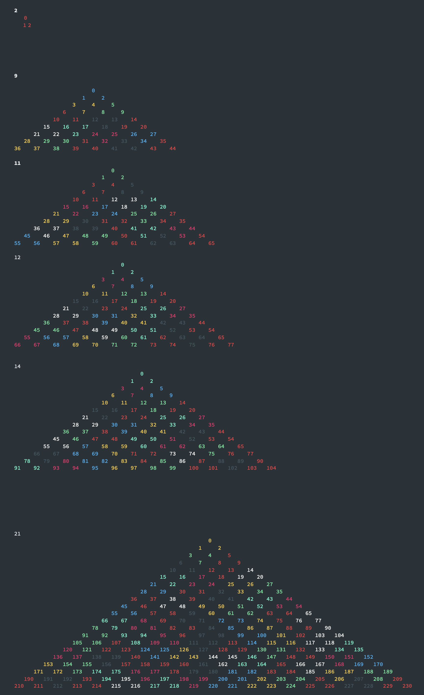

# Solution
I first noticed a relation between the number of dots and the triangular numbers. `T(N) = N*(N+1)/ 2`. After some time, with brute forcing it by hand I noticed 9, 11, 12, 14 worked. I then tried to write an algorithm to recursively find the triads.

I represent this as a directed graph:
```
                        0  
                     1     2  
                  3     4     5  
               6     7     8     9  
```

Where, each number points to then number below it and to the left and below it and to the right. A node also points to the next number in the row, if there is one

So, if `N = 4`, `T(N) = 10`. 

```js
0 -> {1, 2}
1 -> {2, 3, 4}
2 -> {4, 5}
3 -> {4, 6, 7}
4 -> {5, 7, 8}
5 -> {8, 9}
6 -> {7}
7 -> {8}
8 -> {9}
9 -> {}
```

Then, the recursive algorithm decides goes through each dot. It picks the dot to its right in its row, and to its bottom right, and tries to make a triad. It then sets these dots to be 'used', and then recursively tries all other combinations. If it fails, it fails. 

Experimentally, I was able to solve for N<20, but then for probably the first time in my life, the runtime of a actual program I wrote became a limiting factor.

```
2       true    0.538713ms
3       false   0.056309ms
4       false   0.026469ms
5       false   0.008643ms
6       false   0.016236ms
7       false   0.022612ms
8       false   0.081329ms
9       true    0.062718ms
10      false   0.947802ms
11      true    0.081989ms
12      true    0.095513ms
13      false   7.163486ms
14      true    0.110075ms
15      false   15.207301ms
16      false   41.535941ms
17      false   58.837804ms
18      false   240.664708ms
19      false   1178.704311ms
20      false   6909.30447ms
21      true    0.111804ms
```

It also makes cool art:


What is interesting is that when there solutions, they are found very fast. There are always at least two solutions, because you can mirror a solution and still have one. I figure there might be more, so in my recursive call, I capped the recursive calls to 900000.

```c
2       true    0.602138ms      3
3       false   0.062141ms      4
4       false   0.003768ms      0
5       false   0.022393ms      20
6       false   0.015033ms      39
7       false   0.004234ms      0
8       false   0.076065ms      165
9       true    0.073596ms      93
10      false   0.01128ms       0
11      true    0.718814ms      175
12      true    0.148022ms      219
13      false   0.022603ms      0
14      true    0.185614ms      410
15      false   29.243183ms     161144
16      false   0.017909ms      0
17      false   65.073839ms     2662475
18      false   209.543367ms    9000014
19      false   0.020611ms      0
20      false   210.772252ms    9000023
21      true    0.886985ms      2892
22      false   0.028992ms      0
23      true    2.693771ms      5337
24      true    3.81632ms       7166
25      false   0.065817ms      0
26      true    5.102339ms      13671
27      false   188.803518ms    9000045
28      false   0.062354ms      0
29      false   187.266062ms    9000062
30      false   187.56116ms     9000058
31      false   0.059807ms      0
32      false   179.578829ms    9000069
33      true    2.796565ms      107985
34      false   0.054795ms      0
35      true    6.166143ms      203361
36      true    7.159246ms      279533
37      false   0.011902ms      0
38      true    10.805678ms     532840
39      false   194.507512ms    9000110
40      false   0.012957ms      0
```

2 + 9 + 11 + 12 + 14 + 21 + 23 + 24 + 26 + 33 + 35 + 36 + 38 = 284.

Looking at the true ones, there is a pattern.
```
2  __ __ __ __ __ __ 9  __ 11 12 __ 14 __ __ __ __ __ __ 21 __ 23 24 __ 26 __ __ __ __ __ __ 33 __35 36 __ 38 __ __
```
Starting from 9, the next is skipped, then two true in a row, then the next is skipped, then true, then 6 are skipped, and then it repeats. 45 for example was able to be found.

Another interesting thing is that you can write triangular numbers as other triangular numbers. T(9) = 3 * T(4) + T(5). If you split a triangular grid into smaller subsections of triangles
this is easier to see. 

Similarly, if you know that N=11 and N=12 are solutions, then you know 23 (11+11+1) is a solution. This because you can split a triangular grid when N=23 into 3 N=11 triangles and a N=12 triangle.

So there are a ton of cool patterns. Curious if there is some sort of mathematical proof 